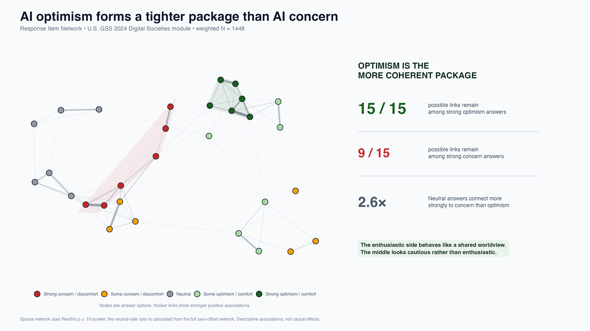

# Study 01 — AI optimism forms a tighter package than AI concern



> **AI disclosure:** This entire analysis—including the coding, analysis script, and figure—was AI generated. It is an exploratory demonstration, not a peer-reviewed study.

## Takeaway

In the 2024 U.S. General Social Survey, the six strong-optimism answers form a complete response network: all 15 possible cross-question links remain in the displayed ResIN. Only 9 of the 15 equivalent links remain among strong-concern answers. In the full zero-offset network, neutral answers connect 2.6 times more strongly to concern than to optimism.

> **AI optimism behaves like a shared worldview. Concern is more fragmented, and the neutral middle leans cautious rather than enthusiastic.**

## Data and questions

The study uses the U.S. 2024 fielding of the International Social Survey Programme **Digital Societies** module, delivered through the General Social Survey. Six questions cover:

- whether technology makes life easier;
- whether technology does more harm than good;
- opportunities for the next generation;
- worry about AI or machines taking jobs;
- comfort with AI-assisted surgery;
- comfort with driverless cars.

The two 0–10 comfort items are grouped into five ordered bands. All questions are then expressed on the same direction scale: strong concern/discomfort, some concern/discomfort, neutral, some optimism/comfort, and strong optimism/comfort. The technology-harm item is reversed because disagreement indicates a more positive technology outlook.

Complete responses with the GSS post-stratification person weight (`WTSSPS`) produce a weighted analytic sample of **1,448** respondents.

## What the figure reports

The displayed network is produced with the R package `ResIN` using its positive-edge force-directed layout, a fixed seed, zero offset, and the package's unadjusted p ≤ .10 significance screen. The screen creates the readable elongated network and is used to compare the number of retained extreme-response links.

The 2.6× neutral-side statistic is calculated separately from the full positive, zero-offset network. It compares the total ResIN edge weight from neutral answers to the two concern levels with the total edge weight from neutral answers to the two optimism levels.

These are descriptive associations, not causal effects or population typologies.

## Reproduce the final image

From the repository root, run:

```sh
Rscript analysis.R
```

This single script downloads the public GSS 2024 data into `data/gss2024.sav` when needed, runs both required ResIN models, calculates the three displayed statistics, and writes `resin_social_takeaway.png`.

Required R packages: `foreign`, `ResIN`, `ggplot2`, `patchwork`, and `scales`.

## Sources

- [General Social Survey: 2024 cross-sectional data release](https://gss.norc.org/)
- [GSS 2024 public data archive (ARDA)](https://thearda.com/data-archive?fid=GSS2024&tab=3)
- [ISSP Digital Societies module documentation](https://www.gesis.org/en/issp/data-and-documentation/digital-societies)
- [ResIN R package](https://cran.r-project.org/package=ResIN)
- [Warncke et al. (2026), *Introducing ResIN: Response Item Networks*](https://osf.io/7jvqc/)
